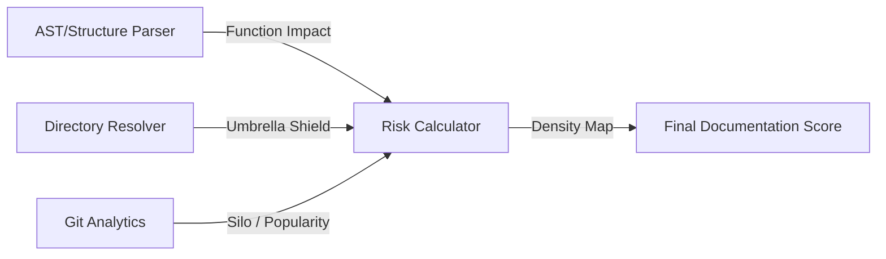

# Documentation Risk Exposure

> **File Reference:** [`gitgalaxy/metrics/signal_processor.py`](file:///home/joe/nyx_projects/gitgalaxy/gitgalaxy/metrics/signal_processor.py)
>
> **Metric:** Contextual Knowledge Debt & Undocumented Risk Density
>
> **Summary:** Evaluates documentation risk not by raw comment line counts, but by weighing the structural complexity of undocumented functions against existing inline comments, docstrings, and directory-level documentation (such as `README.md` or `ARCHITECTURE.md`). Risk is amplified for highly imported hub files (blast radius) and single-author files (bus factor risk).
>
> **Effect:** Maps directly to the GitGalaxy Universal Risk Spectrum:
> * 🟦 **VERY LOW (Score 0-19):** Fully Documented. Code is well-commented or protected under a comprehensive directory documentation shield.
> * 🟨 **INTERMEDIATE (Score 40-59):** Moderate. Standard code complexity with acceptable inline comments.
> * 🟥 **VERY HIGH (Score 80-100+):** Critical Exposure. Complex, highly-coupled, or single-author logic operating without documentation.

## Engineering Summary
This subsystem measures the contextual knowledge debt of a codebase. It solves the problem of using naive comment-to-code ratios by structurally evaluating undocumented logic against high-level documentation defenses. The system exists to identify complex, undocumented, single-author hotspots that create institutional knowledge silos. By integrating blast radius and bus factor multipliers, it feeds directly into the GitGalaxy risk assessment pipeline.

## Purpose
To calculate the structural risk of undocumented code by weighing the complexity of unannotated functions against protective documentation layers (inline and directory-level), subsequently scaling by network centrality and author concentration.

## Problem Being Solved
Simple comment line counts fail to evaluate whether the comments actually explain complex logic. A 1000-line file of simple data structures needs no documentation, but a 100-line undocumented state machine creates massive risk. Furthermore, an undocumented file authored by a single developer creates a severe "bus factor" vulnerability.

## Design
Evaluates four contextual dimensions:
1. **Undocumented Logic Complexity:** Measures the structural `impact` and `big_o_depth` of unannotated functions.
2. **Directory Documentation Shield:** Sweeps for "Knowledge Anchors" (`README.md`, `ARCHITECTURE.md`) applying a `doc_umbrella` defense value.
3. **Markdown Formatting Density:** Parses structural indicators in markdown (code blocks, diagrams, headers, links).
4. **Blast Radius & Bus Factor:** Scales risk if the file is heavily imported (network multiplier) or authored by one person (silo multiplier).

**Mathematical Formulation**
1. **Knowledge Shield Defense:**
$$\text{UmbrellaDefense} = \text{doc\_umbrella} \times 50.0$$
$$\text{DefenseHits} = \left( \text{InlineDocs} + (\text{Ownership} \times 0.5) + (\text{DocLOC} \times 0.33) + \text{UmbrellaDefense} \right) \times Fc$$
2. **Undocumented Risk Calculation:**
$$\text{UndocumentedRisk} = \sum_{\text{undocumented}} \left( 5.0 + (\ln(\text{Impact}) \times (\text{BigO} \times 0.5)) \right)$$
$$\text{RiskHits} = \text{UndocumentedRisk} + (\text{API\_Exposure} \times 2.0) + Irc$$
3. **Net Exposure & Line Density:**
$$\text{NetExposure} = \max\left(0, \text{RiskHits} - \frac{\text{DefenseHits}}{2.0}\right)$$
$$\text{Density} = \left( \frac{\text{NetExposure}}{\max(\text{LOC}, 1)} \right) \times 100.0$$
4. **Systemic Multipliers & Mapping:**
$$\text{FinalMultiplier} = \left(1.0 + \frac{\text{Pop}}{10}\right) \times \left(1.0 + \frac{\text{Silo}}{200}\right) \times Mp$$
$$\text{RawRisk} = \frac{100.0}{1 + e^{-0.2 \times (\text{Density} - 10.0)}}$$

## Pipeline Integration

- **Inputs received:** Function metrics (`impact`, `big_o_depth`), documentation hits, directory shields (`doc_umbrella`), file popularity, and silo exposure.
- **Outputs produced:** A normalized documentation risk score (0-100).
- **Dependencies:** Relies heavily on the Directory Resolver for umbrella logic and Git Analytics for author concentration.

## Tradeoffs
- Valuing `README.md` files as a directory-wide "umbrella shield" assumes the documentation covers the local files accurately, which risks masking undocumented internal files if the README is superficial.
- Dividing `DefenseHits` by 2.0 in the net exposure calculation structurally biases the metric to penalize complex undocumented code more heavily than it rewards documentation, prioritizing risk identification over perfect equilibrium.
- Applying single-author penalties (Bus Factor) assumes collaboration is always necessary, which may unfairly penalize specialized domain experts working in isolated repositories.

## Limitations
- Cannot semantically read comments to confirm they explain the code (a comment saying "stuff happens here" provides defense weight).
- Network multipliers (popularity) only track internal repository imports and cannot measure external library consumers.
- Implicit languages with less rigid docstring structures might receive lower fidelity coefficients ($Fc$), unfairly elevating risk in Python or JavaScript projects lacking explicit type tags.

## Performance Notes
Calculating the undocumented risk loop requires iterating over all functions within the file ($O(F)$ where $F$ is function count). Since $F$ is typically small, execution remains exceptionally fast and bounded.

## Future Work
Current behavior only checks for the presence of docstrings and calculates a bus factor. Planned improvements involve LLM-based semantic validation to ensure documentation aligns with actual logic behavior, and integrating with external dependency graphs to measure true public API blast radius.

## Related Components
- Git Analytics Engine (Bus Factor)
- Directory Resolver (Umbrella Shield)
- Path Context Modifier