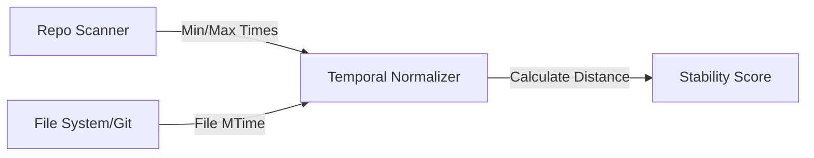

# File Stability (Commit Age & Timestamp Heat)

> **File Reference:** [`gitgalaxy/metrics/signal_processor.py`](https://github.com/squid-protocol/gitgalaxy/blob/main/gitgalaxy/metrics/signal_processor.py)
>
> **Metric:** Relative Temporal Distance & File Modifications
>
> **Summary:** Evaluates file age and timestamp stability across the repository. Instead of treating older code as inherently problematic, stability measures the relative time elapsed since a file was last modified compared to the newest and oldest timestamps in the repository.
>
> **Effect:** Maps directly to the GitGalaxy Universal Risk Spectrum:
> * 🟦 **RECENT / ACTIVE (Score 0-19):** Code modified very recently (the active edge of development).
> * 🟨 **SETTLED (Score 40-59):** Code modified near the midpoint of the repository timeline.
> * 🟥 **ESTABLISHED BASELINE (Score 80-100):** The oldest, long-unmodified files in the repository.

## Engineering Summary
This subsystem evaluates the relative age of source files based on modification timestamps. It solves the problem of treating older, stable code as inherently stale or problematic by shifting to a relative temporal distance model. It exists to provide a physical timeline context to other risk metrics, differentiating between active feature edges and established foundational baselines. This timestamp normalization integrates directly into the GitGalaxy temporal scaling pipeline.

## Purpose
To calculate the relative time elapsed since a file was last modified, scaling it against the active lifespan boundary of the entire repository.

## Problem Being Solved
Absolute file age is not actionable because a 3-year-old file in a 10-year-old repository is relatively recent, whereas a 3-year-old file in a 3-year-old repository is the foundational baseline. Simple timestamp lookups fail to provide repository-specific context.

## Design
Using auto-scaling normalization, Phase 1 scans the entire codebase to establish the repository's active lifespan boundary (`RepoMinTime` to `RepoMaxTime`). File stability is then calculated as a linear physical timestamp measurement.

**Mathematical Formulation**
1. **Calculate Temporal Distance:**
The elapsed time between the newest repository file (`RepoMaxTime`) and the target file's timestamp (`FileMTime`) is clamped to $\ge 0.0$:
$$\text{SecondsFromMax} = \max(\text{RepoMaxTime} - \text{FileMTime}, 0.0)$$
2. **Calculate Relative Ratio:**
The distance is normalized against the total active time range of the repository:
$$\text{TimeRange} = \max(\text{RepoMaxTime} - \text{RepoMinTime}, 1.0)$$
$$\text{StabilityScore} = \min\left( \left( \frac{\text{SecondsFromMax}}{\text{TimeRange}} \right) \times 100.0, 100.0 \right)$$
*(When Newest file, Score = 0.0; When Oldest file, Score = 100.0)*

## Pipeline Integration

- **Inputs received:** Target file modification time (`FileMTime`), repository oldest modified time (`RepoMinTime`), repository newest modified time (`RepoMaxTime`).
- **Outputs produced:** A linear normalized stability score (0-100).
- **Dependencies:** Relies upstream on physical file system data or Git commit epoch timestamps.

## Tradeoffs
- Uses a linear scale rather than a logarithmic one. This was chosen to preserve exact temporal proportionality, though it sacrifices the ability to group long tails of legacy files tightly together.
- Operates independently of language or contextual path ($Fc$, $Irc$, $Mp$ are explicitly ignored) because a timestamp is an absolute physical measurement not influenced by syntax or directory structure.

## Limitations
- A single rogue commit (e.g., automated formatting across all files) will reset the `RepoMaxTime` and heavily skew the relative age of untouched files.
- Relies on Git commit timestamps which can be manually spoofed or accidentally rewritten during interactive rebases.

## Performance Notes
Requires a complete initial pass (Phase 1) over the codebase to determine global boundaries before calculating individual file scores. Once boundaries are established, the calculation is extremely fast $O(1)$ arithmetic.

## Future Work
Currently relies solely on raw commit epoch timestamps. Planned improvements include clustering algorithms to ignore massive automated formatting commits that artificially reset the active edge of the repository timeline.

## Related Components
- Deep Churn (Volatility normalizer)
- Repository Scanner Phase 1
