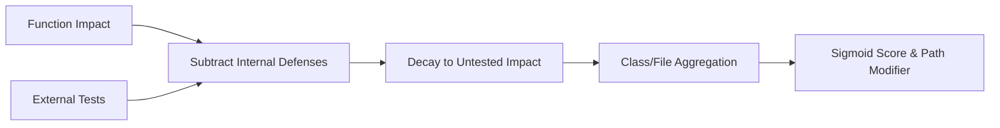

# Verification Risk Exposure (Test Coverage)

> **File Reference:** [`gitgalaxy/metrics/signal_processor.py`](https://github.com/squid-protocol/gitgalaxy/blob/main/gitgalaxy/metrics/signal_processor.py)
>
> **Metric:** Logic Complexity vs. Defensive Test Verification
>
> **Summary:** Measures verification risk by assessing code complexity and structural impact against internal assertions and external test coverage. Rather than relying on simple line-count coverage, GitGalaxy computes residual **Untested Impact** at the function, class, file, directory, and repository levels.
>
> **Effect:** Maps directly to the GitGalaxy Universal Risk Spectrum:
> * 🟦 **VERY LOW (Score 0-19):** High Verification. Functions are heavily covered by targeted unit tests or snapshot assertions.
> * 🟨 **INTERMEDIATE (Score 40-59):** Moderate Exposure. Core paths have basic tests, but some functions lack sufficient defensive assertions.
> * 🟥 **VERY HIGH (Score 80-100+):** Unverified Execution. Complex functions and files operate with minimal or zero test verification.

## Engineering Summary
This subsystem measures the risk of unverified logic execution. It solves the problem of naive line-coverage metrics by structurally evaluating the actual logic complexity of a function against its specific defensive assertions and external test coverage. It exists to highlight brittle, complex logic that lacks testing safeguards, feeding this residual "Untested Impact" directly into the GitGalaxy multi-level risk aggregation pipeline.

## Purpose
To calculate verification risk by subtracting defensive testing mass (internal assertions and external test targets) from raw logic impact, providing a realistic assessment of untested complexity.

## Problem Being Solved
Standard line-coverage tools report high coverage if a file is simply imported and executed, even if the tests contain zero actual assertions (e.g., executing without validating outputs). This creates a false sense of security for highly complex state machines that are executed but fundamentally unverified.

## Design
Verification risk is calculated across a five-level hierarchy:
- **Level 1 (Function):** Calculates `BaseImpact` by subtracting internal defenses (assertions, guards) from structural impact, applying a negative modifier for bypassed tests (`it.skip`). External tests dilute their defensive weight (`DefensiveRatio`) if they target multiple functions. An inverse decay formula yields the residual `UntestedImpact`.
- **Level 2 (Class):** Aggregates function-level impact into `ClassUntestedImpact`.
- **Level 3 (File):** Normalizes total impact per executable line of code (`CodingLOC`), applying a language Opacity Tax ($Ot$), Directory Test Dampener, and Blast Radius to calculate `AdjustedDensity`. A logistic Sigmoid function maps this to a 0–100 score.
- **Level 4 (Directory):** Mass-weighted average using `CodingLOC` of child files.
- **Level 5 (Repository):** Mass-weighted average across top-level directories.

**Mathematical Formulation (Function Level)**
$$\text{BaseImpact} = \max(\text{FunctionImpact} - ((\text{Verification} + \text{Safety} - (\text{Bypassed} \times 2.0)) \times Fc), 0.0)$$
$$\text{DefensiveRatio} = \frac{\sum (\text{EffectiveTestImpact} / \text{TargetCount})}{\text{FunctionImpact}}$$
$$\text{UntestedImpact} = \text{BaseImpact} \times \left( \frac{1}{1 + (C_t \times \text{DefensiveRatio})} \right)$$

## Pipeline Integration

- **Inputs received:** Structural impact, internal assertions, skipped tests, external test targets, `CodingLOC`.
- **Outputs produced:** Residual untested impact and a normalized verification score (0-100).
- **Dependencies:** Relies upstream on structural AST-free logic parsing and test-file coupling analysis.

## Tradeoffs
- Diluting external test impact by dividing by `TargetCount` (the number of functions targeted by a single test) assumes integration tests provide weaker specific verification than isolated unit tests.
- Uses mass-weighted averaging (`CodingLOC`) at the directory and repository levels to prevent tiny untested scripts from skewing the aggregate score, prioritizing complex core logic.
- Test files receive $Mp = 0.0$ to zero out their own risk, intentionally treating test code as structurally exempt from verification requirements.

## Limitations
- Cannot evaluate if an assertion is actually meaningful (e.g., `assert true` provides defensive weight but verifies nothing).
- Does not utilize dynamic execution or runtime tracing, meaning coverage is strictly inferred from static import graphs and testing patterns.

## Performance Notes
The inverse decay computation at the function level and mass-weighted aggregation scale highly efficiently ($O(N)$ with respect to functions and files). 

## Future Work
Current behavior infers external test targeting via static import analysis. Planned improvements involve integrating dynamic coverage reports (e.g., LCOV files) to merge precise runtime hit counts with structural impact calculations.

## Related Components
- Function Structural Impact Calculator
- Path Context Modifier ($Mp$)