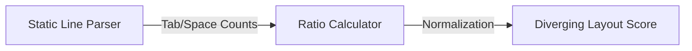

# Layout Uniformity (Indentation Consistency)

> **File Reference:** [`gitgalaxy/metrics/signal_processor.py`](https://github.com/squid-protocol/gitgalaxy/blob/main/gitgalaxy/metrics/signal_processor.py)
>
> **Metric:** Indentation Polarization (Tabs vs. Spaces)
>
> **Summary:** Measures which indentation "camp" a file falls into by calculating the ratio of space-indented lines to tab-indented lines.
>
> **Disclaimer:** *While GitGalaxy is designed for rigorous architectural and security analysis, this specific metric is included as a lighthearted Easter egg for engineering teams. It is reported as descriptive file telemetry (`indentation_style`), not a `RISK_SCHEMA` exposure vector -- see #1147.*
>
> **Effect:** A categorical read, not a scored exposure:
> * 🟩 **Tabs:** 100% Tab Indentation.
> * 🟦 **Mixed (NN.N% Spaces / NN.N% Tabs):** Both styles present in the same file.
> * 🟨 **Spaces:** 100% Space Indentation.
> * ⬜ **Neutral / No Indentation:** File has no indented lines at all.

## Engineering Summary
This subsystem measures the structural formatting consistency of source files by calculating the ratio of spaces to tabs. It solves the problem of identifying files with conflicting editor settings or mixed formatting conventions introduced by multiple contributors. It exists as an independent analytical component to surface formatting noise that causes merge conflicts and developer friction. Though functioning as a novelty metric, its output cleanly integrates into GitGalaxy UI visualizations.

## Purpose
To calculate the polarization of indentation types within a file, surfacing mixed layout formatting where conflicting standards are actively in use.

## Problem Being Solved
Inconsistent formatting creates unnecessary code churn, Git blame noise, and merge conflicts. When multiple developers commit to the same file using different editor settings, the resulting mixed indentation decreases readability and disrupts standardized auto-formatting pipelines.

## Design
The scanner counts leading indentation tokens per line, summing lines that begin with `\t` versus spaces, then maps the ratio to a plain-English label instead of a scored value -- deliberately, so it can't be read as a quality bar to clear.

**Formulation**
1. **Count Indented Lines:**
$$\text{TotalIndentedLines} = \text{TabLines} + \text{SpaceLines}$$
2. **Calculate Space Ratio:**
$$\text{SpaceRatio} = \frac{\text{SpaceLines}}{\text{TotalIndentedLines}} \times 100$$
3. **Map to Label:**
   - `TotalIndentedLines == 0` → `"Neutral / No Indentation"`
   - `SpaceRatio == 0` → `"Tabs"`
   - `SpaceRatio == 100` → `"Spaces"`
   - otherwise → `"Mixed (NN.N% Spaces / NN.N% Tabs)"`

## Pipeline Integration

- **Inputs received:** Token counts for `indent_tabs` and `indent_spaces`.
- **Outputs produced:** A descriptive `indentation_style` label in file telemetry.
- **Dependencies:** Relies directly on the raw static line parser. Does NOT feed into risk aggregation vectors.

## Tradeoffs
- Reported as a categorical label (`telemetry["indentation_style"]`) rather than a 0-100 score. An earlier version scored it into `RISK_SCHEMA` as a diverging 0-100 value ("Civil War Exposure"), which every downstream consumer ended up special-casing as not-a-real-risk anyway -- the label now says directly what the score used to require translating (#1147).
- Empty files or files with no indentation report `"Neutral / No Indentation"` rather than defaulting into either camp.

## Limitations
- Only inspects leading indentation on a per-line basis; it cannot detect mixed spaces and tabs occurring mid-line (e.g., alignment spacing after a tab indent).
- Completely ignores the semantic structure of the language (e.g., Python relying critically on spacing vs C++ using curly braces).

## Performance Notes
Runs continuously during the initial static line parsing phase, adding negligible $O(L)$ operational cost where $L$ is the number of lines. Arithmetic calculation is $O(1)$.

## Future Work
Currently serves strictly as an Easter egg metric isolated from architectural risk. Future considerations may involve extending the logic to detect inconsistent line endings (CRLF vs LF) to further reduce cross-platform structural noise.

## Related Components
- Static Line Parser
