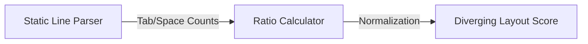

# Layout Uniformity (Indentation Consistency)

> **File Reference:** [`gitgalaxy/metrics/signal_processor.py`](https://github.com/squid-protocol/gitgalaxy/blob/main/gitgalaxy/metrics/signal_processor.py)
>
> **Metric:** Indentation Polarization (Tabs vs. Spaces)
>
> **Summary:** Measures the structural formatting consistency of a file by calculating the ratio of space-indented lines to tab-indented lines. 
> 
> **Disclaimer:** *While GitGalaxy is designed for rigorous architectural and security analysis, this specific metric is included as a lighthearted Easter egg metric for engineering teams. It does not factor into risk exposure vectors.*
>
> **Effect:** Uses a Diverging Visual Spectrum from 0 to 100:
> * 🟩 **PURE TABS (Score 0 - 19):** 100% Tab Indentation.
> * 🟦 **MIXED FORMATTING (Score 20 - 79):** Mixed Tabs and Spaces (50.0 represents maximum conflict).
> * 🟨 **PURE SPACES (Score 80 - 100):** 100% Space Indentation.

## Engineering Summary
This subsystem measures the structural formatting consistency of source files by calculating the ratio of spaces to tabs. It solves the problem of identifying files with conflicting editor settings or mixed formatting conventions introduced by multiple contributors. It exists as an independent analytical component to surface formatting noise that causes merge conflicts and developer friction. Though functioning as a novelty metric, its output cleanly integrates into GitGalaxy UI visualizations.

## Purpose
To calculate the polarization of indentation types within a file, surfacing mixed layout formatting where conflicting standards are actively in use.

## Problem Being Solved
Inconsistent formatting creates unnecessary code churn, Git blame noise, and merge conflicts. When multiple developers commit to the same file using different editor settings, the resulting mixed indentation decreases readability and disrupts standardized auto-formatting pipelines.

## Design
By mapping pure tab indentation to 0.0 and pure space indentation to 100.0, files with mixed indentation naturally center around 50.0. The scanner counts leading indentation tokens per line, summing lines that begin with `\t` versus spaces. 

**Mathematical Formulation**
1. **Count Indented Lines:**
$$\text{TotalIndentedLines} = \text{TabLines} + \text{SpaceLines}$$
2. **Calculate Space Ratio:**
$$\text{SpaceRatio} = \frac{\text{SpaceLines}}{\max(\text{TotalIndentedLines}, 1)}$$
*(Defaults to neutral $50.0$ if unindented or empty)*
3. **Map Final Score:**
$$\text{FinalScore} = \text{SpaceRatio} \times 100.0$$

## Pipeline Integration

- **Inputs received:** Token counts for `indent_tabs` and `indent_spaces`.
- **Outputs produced:** A diverging layout uniformity score (0-100).
- **Dependencies:** Relies directly on the raw static line parser. Does NOT feed into risk aggregation vectors.

## Tradeoffs
- Pure spaces and pure tabs are evaluated as endpoints on a diverging spectrum rather than scoring "perfect consistency" as 0.0. This choice explicitly forces a visual distinction between space-heavy and tab-heavy files rather than just reporting the presence of conflict.
- Empty files or files with no indentation default to exactly 50.0. This neutral baseline was chosen to prevent divide-by-zero errors without skewing the file towards either specific layout preference.

## Limitations
- Only inspects leading indentation on a per-line basis; it cannot detect mixed spaces and tabs occurring mid-line (e.g., alignment spacing after a tab indent).
- Completely ignores the semantic structure of the language (e.g., Python relying critically on spacing vs C++ using curly braces).

## Performance Notes
Runs continuously during the initial static line parsing phase, adding negligible $O(L)$ operational cost where $L$ is the number of lines. Arithmetic calculation is $O(1)$.

## Future Work
Currently serves strictly as an Easter egg metric isolated from architectural risk. Future considerations may involve extending the logic to detect inconsistent line endings (CRLF vs LF) to further reduce cross-platform structural noise.

## Related Components
- Static Line Parser
