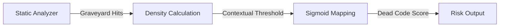

# Graveyard Exposure (Dead & Commented-Out Code)

> **File Reference:** [`gitgalaxy/metrics/signal_processor.py`](file:///home/joe/nyx_projects/gitgalaxy/gitgalaxy/metrics/signal_processor.py)
>
> **Metric:** Dead Code Density & Inactive Logic Retention
>
> **Summary:** Measures the density of commented-out source code blocks ("dead code"). Commented-out logic adds cognitive noise for developers who must mentally parse and discard inactive code paths.
>
> **Effect:** Maps directly to the GitGalaxy Universal Risk Spectrum:
> * 🟦 **CLEAN (Score 0-19):** Active, clean, executable code. Zero dead code detected.
> * 🟨 **INTERMEDIATE (Score 40-59):** Minor inactive snippets or temporary commented blocks.
> * 🟥 **HIGH GRAVEYARD RISK (Score 80-100):** Heavily polluted with dead code blocks requiring cleanup.

## Engineering Summary
This subsystem quantifies the density of commented-out programmatic logic. It solves the problem of code graveyards persisting indefinitely by differentiating natural language comments from syntactically dense inactive code. It exists to highlight files polluted with cognitive noise that slow down active maintenance and refactoring. Integrated with dynamic thresholding, it provides GitGalaxy with a clear indicator of codebase hygiene.

## Purpose
To calculate dead code density against the total physical size of the file and map it to a risk score, exposing inactive logic retention.

## Problem Being Solved
Commented-out code causes significant cognitive friction. Developers reading the file must parse the dead logic, determine if it was temporarily disabled for debugging or permanently abandoned, and decide whether it is safe to delete. Standard linters ignore comment blocks entirely, allowing this noise to accumulate.

## Design
The static analysis engine specifically identifies syntax-dense comment blocks as opposed to English docstrings.
- Each `graveyard_hits` is estimated to represent 3 lines of inactive logic.
- Density is normalized against a minimum safe floor of 50 LOC to prevent small files from spiking in severity.
- A baseline tolerance threshold (10%) is adjusted dynamically by the directory Path Modifier ($Mp$).

**Mathematical Formulation**
1. **Clean File Short-Circuit:** If `graveyard_hits == 0`, score is `0.0`.
2. **Calculate Dead Code Density:**
$$\text{GhostLines} = \text{graveyard\_hits} \times 3.0$$
$$\text{Density} = \left( \frac{\text{GhostLines}}{\max(\text{TotalLOC}, 50.0)} \right) \times 100.0$$
3. **Compute Contextual Tolerance Threshold:**
$$\text{Threshold} = \frac{10.0}{\max(Mp, 0.1)}$$
4. **Sigmoidal Score Mapping:**
$$\text{Score} = \frac{100.0}{1 + e^{-0.3 \times (\text{Density} - \text{Threshold})}}$$
$$\text{FinalScore} = \min(\text{Score}, 100.0)$$

## Pipeline Integration

- **Inputs received:** Heuristic `graveyard_hits` from static parser, `TotalLOC`, and Path Modifier ($Mp$).
- **Outputs produced:** A normalized graveyard risk score (0-100).
- **Dependencies:** Relies upstream on accurate regex differentiation between natural language comments and code-comments.

## Tradeoffs
- Implements a minimum safe floor of 50 LOC. This decision explicitly sacrifices mathematical purity for small files to prevent a single 3-line commented snippet from generating a 100.0 score in a 5-line script.
- Uses an estimated multiplier (3.0x lines per hit) rather than tracking exact line-counts of the commented block. This drastically speeds up parsing logic but sacrifices exact volume precision.
- Bypasses language opacity ($Irc$) and fidelity ($Fc$) because dead code causes equivalent cognitive friction regardless of the underlying language syntax.

## Limitations
- Heavily dependent on heuristic regex. Highly technical natural language comments (e.g., Markdown code blocks inside docstrings) may be falsely flagged as dead code.
- Conversely, small, isolated variables commented out on a single line might not trigger the density heuristic and could be missed.

## Performance Notes
Includes an immediate short-circuit for clean files (`graveyard_hits == 0`). Since the majority of production files have zero dead code, this avoids triggering floating-point math entirely, ensuring near-instantaneous execution.

## Future Work
Currently relies on static regex heuristics. Planned improvements involve utilizing AST parsers to attempt a dry compilation of the comment blocks to explicitly verify if the content is valid, compilable code rather than technical prose.

## Related Components
- Static Analysis Engine
- Path Modifier ($Mp$)
