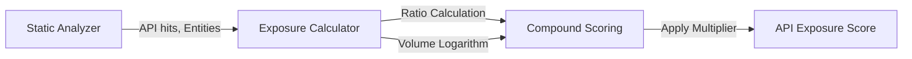

# API Exposure

> **File Reference:** [`gitgalaxy/metrics/signal_processor.py`](https://github.com/squid-protocol/gitgalaxy/blob/main/gitgalaxy/metrics/signal_processor.py)
>
> **Metric:** Public API Surface Area & Export Ratio
>
> **Summary:** Measures the permeability of a module's public boundary by comparing exported public endpoints to total declared entities (functions + classes). It allows developers to distinguish encapsulated internal helpers from heavily exposed public interfaces.
>
> **Effect:** Maps directly to the GitGalaxy Universal Risk Spectrum:
> * 🟦 **VERY LOW (Score 0-19):** Encapsulated Vault. Internal utility module with no public export surface.
> * 🟨 **MODERATE (Score 40-59):** Balanced API. Balanced mix of public methods and internal private helpers.
> * 🟥 **VERY HIGH (Score 80-100):** Public Entry Point. Exposes a large volume of public functions/classes to external consumers.

## Engineering Summary
This subsystem quantifies the public surface area of a given module. It solves the problem of structural ambiguity by algorithmically identifying whether a file functions as an internal utility vault or a heavily exposed public entry point. It exists to monitor API boundary permeability, highlighting modules that export too much logic. Integrated within GitGalaxy, it operates independently of language syntax by analyzing explicit export boundaries.

## Purpose
To measure the ratio of exported public endpoints against total declared entities, evaluating the encapsulation and overall external surface area of a source file.

## Problem Being Solved
Files that expose every internal function and class create highly coupled, brittle systems where changing internal implementation details breaks external consumers. Developers need visibility into which modules are leaking their internal state versus those properly encapsulating logic behind a narrow public interface.

## Design
The calculation combines a relative export ratio (40% weight) with an absolute logarithmic endpoint volume (60% weight).
- **Numerator:** Export keywords (`export`, `public`, `module.exports`) or casing conventions (Go/Python).
- **Denominator:** Total logical entities (functions + classes).

**Mathematical Formulation**
1. **Encapsulation Short-Circuit:** If `api_hits == 0`, score is `0.0`.
2. **Exposure Ratio Calculation (40% Weight):**
$$\text{Entities} = \max(\text{func\_start} + \text{class\_start}, 1)$$
$$\text{Ratio} = \min\left( \frac{\text{api\_hits}}{\text{Entities}}, 1.0 \right)$$
3. **Logarithmic Volume Calculation (60% Weight):**
$$\text{VolumeWeight} = \min\left( \frac{\log_{10}(\text{api\_hits} + 1)}{1.5}, 1.0 \right)$$
4. **Compound Score & Path Modifier:**
$$\text{RawScore} = \left( (\text{Ratio} \times 0.4) + (\text{VolumeWeight} \times 0.6) \right) \times 100.0$$
$$\text{FinalScore} = \min(\text{RawScore} \times Mp, 100.0)$$

## Pipeline Integration

- **Inputs received:** Heuristic `api_hits`, function counts, class counts, and Path Modifier ($Mp$).
- **Outputs produced:** A normalized API exposure score (0-100).
- **Dependencies:** Relies upstream on structural entity counting from the static analysis engine.

## Tradeoffs
- Weighting absolute volume heavily (60%) over pure ratio (40%) ensures that a file exporting 1 public function out of 1 total (100% ratio) scores much lower than a file exporting 50 public functions out of 100 (50% ratio). This correctly flags massive API surfaces over tiny single-export scripts.
- Logarithmic scaling for absolute volume ensures that scores do not scale infinitely, capping out reasonably as API sizes hit critical mass.

## Limitations
- Relies purely on keyword and syntax conventions; it cannot deduce if a weakly-typed language module technically allows external consumption of unexported properties via runtime reflection.
- Cannot evaluate the semantic complexity of the exported API (e.g., exposing one massive god-object is scored lower in volume than exposing 10 tiny pure functions).

## Performance Notes
Utilizes an immediate short-circuit for files with zero `api_hits`, returning $0.0$. Arithmetic calculations operate in $O(1)$ time based on pre-scanned token counts.

## Future Work
Current metrics evaluate intra-file API volume. Planned improvements involve analyzing inter-file dependency graphs to measure true consumer blast radius (how many other files actually import the exposed API).

## Related Components
- Static Analysis Engine
- Path Context Modifier ($Mp$)
