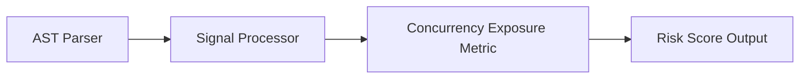

# Concurrency Exposure

> **File Reference:** [`gitgalaxy/metrics/signal_processor.py`](file:///home/joe/nyx_projects/gitgalaxy/gitgalaxy/metrics/signal_processor.py)

## Engineering Summary
Evaluates the density of asynchronous execution primitives and multithreading logic within a source file. Concurrent programming increases non-deterministic execution paths, raising cognitive load and introducing risks such as race conditions, deadlocks, and resource contention. This subsystem evaluates the input signals to calculate a formalized risk score. In GitGalaxy, this subsystem is known as the Concurrency Exposure metric.

## Purpose
The metric calculates a density-based risk score (0-100) to flag files containing high-risk logic patterns and architectural deviations.

## Problem Being Solved
Unmitigated anti-patterns and vulnerabilities often lead to hard-to-debug bugs and security flaws. By statically analyzing the codebase, this subsystem proactively identifies hazardous logic.

## Design
The static analysis engine extracts concurrency keywords and synchronization primitives across supported language standards:

| Variable | Signal Category | Weight / Role | Description |
| :--- | :--- | :--- | :--- |
| `raw_concurrency` | Keywords | **1.0x** | Asynchronous and threading constructs: `async`, `await`, `Promise`, `thread`, `spawn`, `go`, `chan`, `synchronized`. |
| `sync_locks` | Mitigations | **-1.5x** | Synchronization primitives (mutexes, locks, semaphores). Each lock mitigates 1.5 thread spawns. |
| `loc` | Denominator | **Base Density** | Meaningful lines of code, padded by `loc_padding` (default 150). |
| `irc` | Language Modifier | **0.1x** | Implicit Risk Correction for dynamically typed or implicit concurrency models. |
| `mp` | Path Modifier | **Threshold Modifier** | Context-specific modifier (e.g., `0.5` for UI components where race conditions trigger UI defects). |

The calculation balances raw concurrency against synchronization locks and applies a sigmoid transformation.

### 1. Net Concurrency Balance
Subtract synchronization primitives from raw concurrency signals:

$$\text{net\_concurrency} = \max(0.0, \text{raw\_concurrency} - (\text{sync\_locks} \times 1.5))$$

If $\text{net\_concurrency} = 0$, the metric immediately returns $0.0$.

### 2. Density Calculation
Density measures concurrent logic per line of code, factoring in implicit language risk ($\text{IRC} \times 0.1$):

$$\text{Density} = \left( \frac{\text{net\_concurrency}}{\max(\text{LOC} + \text{loc\_padding}, 1)} \right) \times 100.0 + (\text{IRC} \times 0.1)$$

### 3. Sigmoid Transformation
Maps density to a 0–100 score using a base threshold of $4.0$ and slope of $0.4$, scaled by the path modifier ($Mp$):

$$\text{RawScore} = \frac{1.0}{1.0 + e^{-0.4 \times (\text{Density} - 4.0)}}$$
$$\text{FinalScore} = \min(\text{RawScore} \times 100.0 \times Mp, 100.0)$$

```python
def _calc_concurrency(
    self,
    loc: int,
    raw_signals: dict[str, int],
    irc: int,
    mp: float,
) -> float:
    """
    RISK: Threads/Async execution.
    MITIGATION: Mutex/Locks/Semaphores (sync_locks).
    """
    tuning = self.risk_tuning.get("concurrency", {})
    loc_padding = tuning.get("loc_padding", 150)

    raw_concurrency = float(raw_signals.get("concurrency", 0))
    sync_locks = float(raw_signals.get("sync_locks", 0))

    # Balance concurrency with synchronization locks
    net_concurrency = max(0.0, raw_concurrency - (sync_locks * 1.5))

    if net_concurrency == 0:
        return 0.0

    density = (net_concurrency / max(loc + loc_padding, 1)) * 100.0
    density += irc * tuning.get("irc_mult", 0.1)

    threshold = tuning.get("threshold_base", 4.0)
    slope = tuning.get("sigmoid_slope", 0.4)

    return min(self._sigmoid(density, threshold, slope) * 100.0 * mp, 100.0)
```

**Risk Classification:**
* 🟦 **LOW (Score 0–19):** Sequential execution. Logic runs deterministically with minimal or no asynchronous branching.
* 🟨 **MODERATE (Score 40–59):** Standard asynchronous operations (e.g., standard `async`/`await` patterns or thread management) with bounded execution.
* 🟥 **VERY HIGH (Score 80–100):** High-density multithreading or unmitigated concurrency channels.

## Pipeline Integration
Inputs received include raw static analysis signals from the AST parser and contextual multipliers. Outputs produced are a normalized risk score (0-100). The subsystem depends on upstream token parsers that feed AST information into the signal processor.


## Tradeoffs
* Chose static keyword counting and heuristic multipliers over dynamic symbolic execution to prioritize speed across large codebases.
* Specific weights are fixed heuristics that balance safety against over-penalization, sacrificing precise dynamic validation for constant-time calculation.

## Limitations
* Detection is strictly reliant on recognized keywords and standard patterns.
* Cannot dynamically confirm actual vulnerabilities or trace deep runtime dataflows.
* May produce false positives in non-standard or heavily abstracted codebases.

## Performance Notes
The calculation operates in $O(1)$ time leveraging pre-computed token counts, making it suitable for real-time risk profiling on massive codebases.

## Future Work
* Planned improvements include integrating static dataflow tracing to verify execution paths and reduce false positives.
* Expand language support and framework-specific annotations.

## Related Components
* **[Signal Processor Module](file:///home/joe/nyx_projects/gitgalaxy/gitgalaxy/metrics/signal_processor.py)**
* **[GitGalaxy Platform](https://gitgalaxy.io/)**
* **[⬅️ Back to Master Index](index.md)**
