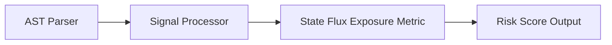

# State Flux Exposure

> **File Reference:** [`gitgalaxy/metrics/signal_processor.py`](file:///home/joe/nyx_projects/gitgalaxy/gitgalaxy/metrics/signal_processor.py)

## Engineering Summary
Evaluates the density of variable mutations and state modifications within a module. State flux measures data volatility by tracking property reassignments, array mutations, and side effects. High state flux indicates unstable data structures where tracking state transitions increases cognitive load and defect probability. This subsystem evaluates the input signals to calculate a formalized risk score. In GitGalaxy, this subsystem is known as the State Flux Exposure metric.

## Purpose
The metric calculates a density-based risk score (0-100) to flag files containing high-risk logic patterns and architectural deviations.

## Problem Being Solved
Unmitigated anti-patterns and vulnerabilities often lead to hard-to-debug bugs and security flaws. By statically analyzing the codebase, this subsystem proactively identifies hazardous logic.

## Design
The static analysis engine counts mutation keywords and immutability controls:

| Variable | Signal Category | Weight / Role | Description |
| :--- | :--- | :--- | :--- |
| `raw_flux` | `state_mutation` | **1.0x** | Reassignment and mutation keywords: `let`, `var`, `mut`, `setState`, `push`, `pop`, `+=`, `=`. |
| `freeze_hits` | `immutability_locks` | **-0.5x** | Immutability enforcements (`Object.freeze`, const locks). Subtracts 0.5 per hit from raw mutation. |
| `loc` | Denominator | **Base Density** | Meaningful lines of code (`loc_padding` defaults to 0 to ensure mutations immediately impact density). |
| `irc` | Language Modifier | **0.15x** | Implicit Risk Correction (accounts for implicit mutability defaults in languages like JavaScript or Python). |
| `mp` | Path Modifier | **Threshold Modifier** | Context modifier (e.g., `0.8` for UI components where state spaghetti introduces UI state bugs). |

### 1. Net Volatility Calculation
Balance raw mutation signals against immutability markers:

$$\text{net\_volatility} = \max(0.0, \text{raw\_flux} - (\text{freeze\_hits} \times 0.5))$$

If $\text{net\_volatility} = 0$, the function returns $0.0$.

### 2. Volatility Density
Calculate mutation density per line of code, adding the dampened language risk ($\text{IRC} \times 0.15$):

$$\text{Density} = \left( \frac{\text{net\_volatility}}{\max(\text{LOC} + \text{loc\_padding}, 1)} \right) \times 100.0 + (\text{IRC} \times 0.15)$$

### 3. Sigmoid Normalization
Map density using a base threshold of $15.0$ and slope of $0.2$, scaled by the path modifier ($Mp$):

$$\text{RawScore} = \frac{1.0}{1.0 + e^{-0.2 \times (\text{Density} - 15.0)}}$$
$$\text{FinalScore} = \min(\text{RawScore} \times 100.0 \times Mp, 100.0)$$

```python
def _calc_state_flux(self, loc: int, raw_signals: dict[str, int], irc: int, mp: float) -> float:
    """
    Calculates State Flux Exposure & Mutation Volatility.
    """
    tuning = self.risk_tuning.get("state_flux", {})
    loc_padding = tuning.get("loc_padding", 0)

    raw_flux = float(raw_signals.get("state_mutation", 0))
    freeze_hits = float(raw_signals.get("immutability_locks", 0))

    # Subtract immutability locks from raw mutation
    net_volatility = max(0.0, raw_flux - (freeze_hits * 0.5))

    if net_volatility == 0:
        return 0.0

    density = (net_volatility / max(loc + loc_padding, 1)) * 100.0
    density += irc * tuning.get("irc_mult", 0.15)

    threshold = tuning.get("threshold_base", 15.0)
    slope = tuning.get("sigmoid_slope", 0.2)

    return min(self._sigmoid(density, threshold, slope) * 100.0 * mp, 100.0)
```

**Risk Classification:**
* 🟦 **VERY LOW (Score 0–19):** Immutable or referentially transparent logic. Variables are initialized once and rarely modified.
* 🟨 **MODERATE (Score 40–59):** Standard local mutation (e.g., loop counters, localized state changes).
* 🟥 **VERY HIGH (Score 80–100):** High-frequency reassignments and shared state mutations lacking immutability protections.

## Pipeline Integration
Inputs received include raw static analysis signals from the AST parser and contextual multipliers. Outputs produced are a normalized risk score (0-100). The subsystem depends on upstream token parsers that feed AST information into the signal processor.


## Tradeoffs
* Chose static keyword counting and heuristic multipliers over dynamic symbolic execution to prioritize speed across large codebases.
* Specific weights are fixed heuristics that balance safety against over-penalization, sacrificing precise dynamic validation for constant-time calculation.

## Limitations
* Detection is strictly reliant on recognized keywords and standard patterns.
* Cannot dynamically confirm actual vulnerabilities or trace deep runtime dataflows.
* May produce false positives in non-standard or heavily abstracted codebases.

## Performance Notes
The calculation operates in $O(1)$ time leveraging pre-computed token counts, making it suitable for real-time risk profiling on massive codebases.

## Future Work
* Planned improvements include integrating static dataflow tracing to verify execution paths and reduce false positives.
* Expand language support and framework-specific annotations.

## Related Components
* **[Signal Processor Module](file:///home/joe/nyx_projects/gitgalaxy/gitgalaxy/metrics/signal_processor.py)**
* **[GitGalaxy Platform](https://gitgalaxy.io/)**
* **[⬅️ Back to Master Index](index.md)**
