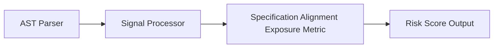

# Specification Alignment Exposure

> **File Reference:** [`gitgalaxy/metrics/signal_processor.py`](file:///home/joe/nyx_projects/gitgalaxy/gitgalaxy/metrics/signal_processor.py)

## Engineering Summary
Measures the gap between executable logic entities (classes and functions) and formal architectural specifications, design documents, or RFC references. Higher spec exposure hits lead to lower risk scores; conversely, modules with numerous functions/classes lacking specification references produce high risk exposure scores ("untraced logic"). This subsystem evaluates the input signals to calculate a formalized risk score. In GitGalaxy, this subsystem is known as the Specification Alignment Exposure metric.

## Purpose
The metric calculates a density-based risk score (0-100) to flag files containing high-risk logic patterns and architectural deviations.

## Problem Being Solved
Unmitigated anti-patterns and vulnerabilities often lead to hard-to-debug bugs and security flaws. By statically analyzing the codebase, this subsystem proactively identifies hazardous logic.

## Design
The analysis engine tallies code structural entities against specification annotations:

| Variable | Signal Category | Role | Description |
| :--- | :--- | :--- | :--- |
| `func_start` | Entity Counter | Denominator Component | Count of function definition starts in the file. |
| `class_start` | Entity Counter | Denominator Component | Count of class definition starts in the file. |
| `spec_exposure` | Specification Hits | Traceability Counter | Count of explicit specification annotations, RFC links, or design doc references. |
| `mp` | Path Modifier | Multiplier | Context modifier adjusting final exposure risk. |

The calculation evaluates the ratio of specification hits to total code entities and inverts it to yield risk exposure:

### 1. Code Entity Tally
Sum total structural entities (functions + classes), enforcing a floor of 1:

$$\text{Entities} = \max(\text{func\_start} + \text{class\_start}, 1)$$

### 2. Traceability Ratio
Divide specification hits by total entities, clamped at a maximum ratio of 1.0:

$$\text{Ratio} = \min\left( \frac{\text{spec\_exposure}}{\text{Entities}}, 1.0 \right)$$

### 3. Inverse Risk Exposure Mapping
Invert the traceability ratio so that 100% specification alignment yields 0 risk, modified by $Mp$:

$$\text{Exposure} = \min((1.0 - \text{Ratio}) \times 100.0 \times Mp, 100.0)$$

```python
def _calc_spec_alignment(self, raw_signals: dict[str, int], mp: float) -> float:
    """
    Calculates Architectural Traceability (Specification Alignment Exposure).
    Returns exposure risk score from 0.0 to 100.0.
    """
    entities = max(raw_signals.get("func_start", 0) + raw_signals.get("class_start", 0), 1)
    ratio = min(raw_signals.get("spec_exposure", 0) / entities, 1.0)
    return min((1.0 - ratio) * 100.0 * mp, 100.0)
```

**Risk Classification:**
* 🟦 **VERY LOW (Score 0–19):** Fully traceable code. Virtually all functions and classes map to formal design specifications or RFC markers.
* 🟨 **MODERATE (Score 40–59):** Partial traceability. Core functions reference specs while supporting functions do not.
* 🟥 **VERY HIGH (Score 80–100):** Untraced logic. High-volume execution logic without architectural specification linkage.

## Pipeline Integration
Inputs received include raw static analysis signals from the AST parser and contextual multipliers. Outputs produced are a normalized risk score (0-100). The subsystem depends on upstream token parsers that feed AST information into the signal processor.


## Tradeoffs
* Chose static keyword counting and heuristic multipliers over dynamic symbolic execution to prioritize speed across large codebases.
* Specific weights are fixed heuristics that balance safety against over-penalization, sacrificing precise dynamic validation for constant-time calculation.

## Limitations
* Detection is strictly reliant on recognized keywords and standard patterns.
* Cannot dynamically confirm actual vulnerabilities or trace deep runtime dataflows.
* May produce false positives in non-standard or heavily abstracted codebases.

## Performance Notes
The calculation operates in $O(1)$ time leveraging pre-computed token counts, making it suitable for real-time risk profiling on massive codebases.

## Future Work
* Planned improvements include integrating static dataflow tracing to verify execution paths and reduce false positives.
* Expand language support and framework-specific annotations.

## Related Components
* **[Signal Processor Module](file:///home/joe/nyx_projects/gitgalaxy/gitgalaxy/metrics/signal_processor.py)**
* **[GitGalaxy Platform](https://gitgalaxy.io/)**
* **[⬅️ Back to Master Index](index.md)**
