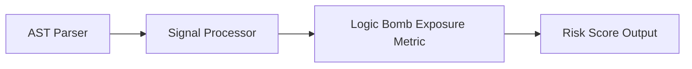

# Logic Bomb Exposure

> **File Reference:** [`gitgalaxy/metrics/signal_processor.py`](file:///home/joe/nyx_projects/gitgalaxy/gitgalaxy/metrics/signal_processor.py)

## Engineering Summary
Identifies potential logic bomb vulnerabilities where conditional triggers (branching logic, thread sleeps, execution delays) lead to destructive payloads (aborts, panics, memory cleanups, dynamic execution, or algorithmic DoS payloads).  This subsystem evaluates the input signals to calculate a formalized risk score. In GitGalaxy, this subsystem is known as the Logic Bomb Exposure metric.

## Purpose
The metric calculates a density-based risk score (0-100) to flag files containing high-risk logic patterns and architectural deviations.

## Problem Being Solved
Unmitigated anti-patterns and vulnerabilities often lead to hard-to-debug bugs and security flaws. By statically analyzing the codebase, this subsystem proactively identifies hazardous logic.

## Design
The metric measures the product of trigger frequency and payload severity:

| Component | Signal Key | Weight | Description |
| :--- | :--- | :--- | :--- |
| **Trigger** | `branch` | **1.0x** | Conditional branching constructs (`if`, `switch`, `case`). |
| **Trigger** | `thread_sleeps` | **3.0x** | Execution delays (`sleep`, timers) often used to delay payload execution. |
| **Payload** | `panics_and_aborts` | **2.0x** | Abort statements, process exits, or panic calls. |
| **Payload** | `cleanup` | **1.5x** | Forceful resource destruction or unmanaged cleanup. |
| **Payload** | `sec_high_risk_execution` | **4.0x** | Dynamic evaluation calls (`eval`, `exec`, process spawns). |
| **Taint Confirmation**| `sec_tainted_injection` | **+500.0 Spike** | Confirmed data path from untrusted input to high-risk execution sink. |

& Safeguards

### 1. Trigger & Payload Formulation
$$\text{Trigger} = \text{branch} + (\text{thread\_sleeps} \times 3.0)$$
$$\text{Payload} = (\text{panics\_and\_aborts} \times 2.0) + (\text{cleanup} \times 1.5) + (\text{sec\_high\_risk\_execution} \times 4.0)$$

### 2. Machine Learning & Hardware Dampeners
To prevent false positives in machine learning, scientific compute, and hardware integration code, payloads are dampened:
$$\text{agent\_dampener} = 1.0 + (\text{scientific} \times 2.0) + (\text{llm\_orchestrator} \times 3.0) + (\text{llm\_local\_compute} \times 2.0)$$
$$\text{hardware\_dampener} = 1.0 + (\text{hardware\_bridge} \times 3.0)$$
$$\text{Payload} = \frac{\text{Payload}}{\text{agent\_dampener} \times \text{hardware\_dampener}}$$

### 3. Algorithmic DoS & Taint Amplification
* **Algorithmic DoS Spike:** If maximum function complexity $\text{Big-O} \ge 3$, additional DoS mass is computed based on API/IO choke points ($\times 10 \times \text{Big-O}^2$) and state mutation bombs ($\times 5 \times \text{Big-O}^2$). Bounded iteration safety checks reduce DoS mass by $75\%$.
* **Confirmed Taint Spike:** If static analysis confirms untrusted input reaches execution sinks, a direct $+500.0$ spike is added to sabotage mass.
* **Contextual Drift:** If local language drift exceeds global repository drift ($\text{local\_drift} / \text{global\_drift} > 1.5$), mass is multiplied by the drift ratio.

### 4. Sigmoid Mapping
$$\text{Density} = \left( \frac{\text{SabotageMass}}{\max(\text{LOC} + 150, 1)} \right) \times 100.0$$

Mapped via Sigmoid (Standard mode threshold = 75.0, slope = 0.2; Paranoid mode threshold = 10.0, slope = 0.5).

```python
def _calc_logic_bomb(
    self,
    loc: int,
    raw_signals: dict[str, int],
    mp: float,
    archetype: str,
    global_drift: float,
    local_drift: float,
    max_big_o: int = 1,
) -> float:
    """
    Calculates Logic Bomb & Sabotage Exposure.
    """
    arch_matrix = self.CONTEXT_VIOLATION_MATRIX.get(archetype, {})
    arch_multiplier = arch_matrix.get("logic_bomb_multiplier", 1.0)

    trigger = raw_signals.get("branch", 0) + (raw_signals.get("thread_sleeps", 0) * 3.0)
    payload = (
        (raw_signals.get("panics_and_aborts", 0) * 2.0)
        + (raw_signals.get("cleanup", 0) * 1.5)
        + (raw_signals.get("sec_high_risk_execution", 0) * 4.0)
    )

    # Machine learning and hardware dampeners
    agent_dampener = (
        1.0
        + (raw_signals.get("scientific", 0) * 2.0)
        + (raw_signals.get("llm_orchestrator", 0) * 3.0)
        + (raw_signals.get("llm_local_compute", 0) * 2.0)
    )
    hardware_dampener = 1.0 + (raw_signals.get("hardware_bridge", 0) * 3.0)
    payload = (payload / agent_dampener) / hardware_dampener

    sabotage_mass = (trigger * payload) * arch_multiplier

    # Algorithmic DoS spike for Big-O >= 3
    if max_big_o >= 3:
        attack_surface = raw_signals.get("api", 0) + raw_signals.get("sec_io", 0) + raw_signals.get("io", 0)
        dos_mass = attack_surface * (max_big_o**2) * 10.0

        flux = raw_signals.get("state_mutation", 0) + raw_signals.get("globals", 0)
        dos_mass += flux * (max_big_o**2) * 5.0

        if raw_signals.get("safety", 0) > 0 or raw_signals.get("panics_and_aborts", 0) > 0:
            dos_mass *= 0.25

        sabotage_mass += dos_mass

    # Direct taint confirmation spike
    taint_confirmed = raw_signals.get("sec_tainted_injection", 0)
    if taint_confirmed > 0:
        sabotage_mass += taint_confirmed * 500.0

    if local_drift > 0 and global_drift > 0:
        drift_delta = local_drift / global_drift
        if drift_delta > 1.5:
            sabotage_mass *= drift_delta

    if sabotage_mass == 0:
        return 0.0

    explicit_threats = raw_signals.get("sec_dead_code", 0) + raw_signals.get("sec_reflection_metaprogramming", 0)
    if max_big_o >= 3:
        explicit_threats += 1

    if explicit_threats == 0 and taint_confirmed == 0 and not getattr(self, "is_paranoid", False):
        sabotage_mass *= 0.05

    t = self.risk_tuning.get("logic_bomb", {})
    density = (sabotage_mass / max(loc + t.get("loc_padding", 150), 1)) * 100.0

    if getattr(self, "is_paranoid", False):
        threshold = t.get("paranoid_threshold", 10.0)
        slope = t.get("paranoid_slope", 0.5)
    else:
        threshold = t.get("std_threshold", 75.0)
        slope = t.get("std_slope", 0.2)

    try:
        score = 100.0 / (1.0 + math.exp(-slope * (density - threshold)))
    except OverflowError:
        score = 100.0 if density > threshold else 0.0

    return min(score * mp, 100.0)
```

**Risk Classification:**
* 🟦 **LOW (Score 0–19):** Standard branching with structured exception handling and no unmitigated aborts or dynamic execution.
* 🟨 **MODERATE (Score 40–59):** Bounded condition-heavy logic with standard fallback aborts in internal utilities.
* 🟥 **VERY HIGH (Score 80–100):** High-branching logic coupled with system halts, dynamic code evaluation, or verified static taint paths.

## Pipeline Integration
Inputs received include raw static analysis signals from the AST parser and contextual multipliers. Outputs produced are a normalized risk score (0-100). The subsystem depends on upstream token parsers that feed AST information into the signal processor.


## Tradeoffs
* Chose static keyword counting and heuristic multipliers over dynamic symbolic execution to prioritize speed across large codebases.
* Specific weights are fixed heuristics that balance safety against over-penalization, sacrificing precise dynamic validation for constant-time calculation.

## Limitations
* Detection is strictly reliant on recognized keywords and standard patterns.
* Cannot dynamically confirm actual vulnerabilities or trace deep runtime dataflows.
* May produce false positives in non-standard or heavily abstracted codebases.

## Performance Notes
The calculation operates in $O(1)$ time leveraging pre-computed token counts, making it suitable for real-time risk profiling on massive codebases.

## Future Work
* Planned improvements include integrating static dataflow tracing to verify execution paths and reduce false positives.
* Expand language support and framework-specific annotations.

## Related Components
* **[Signal Processor Module](file:///home/joe/nyx_projects/gitgalaxy/gitgalaxy/metrics/signal_processor.py)**
* **[GitGalaxy Platform](https://gitgalaxy.io/)**
* **[⬅️ Back to Master Index](index.md)**
