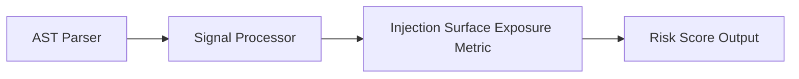

# Injection Surface Exposure — REMOVED (#1020)

> **Status:** This metric no longer exists. `injection_surface` and its
> `_calc_injection_surface()` implementation were deleted by
> [#1020](https://github.com/squid-protocol/gitgalaxy/issues/1020). There is no
> `risk_injection_surface` column, no entry in `RISK_SCHEMA`, and nothing in the engine
> computes an injection score. `grep -rn "injection_surface" --include=*.py gitgalaxy/`
> returns nothing.
>
> This page is kept as a historical record rather than deleted, so the reasoning survives.
> **Do not implement against anything below the line — it documents removed code.**

## Why it was removed

GitGalaxy is AST-less: no Data Flow Analysis (taint tracking) and no Control Flow Graph.
It is therefore structurally unable to prove that untrusted input actually *reaches* a
sensitive sink. The removed metric asserted exactly that proof, by observing that two
unrelated regexes happened to fire in the same file.

#1020 removed five metrics on that basis — `prompt_injection`, `agentic_rce`,
`injection_surface`, `obscured_payload` and `memory_corruption` — and reframed the engine
as a structural and topographical mapper rather than a definitive SAST vulnerability
scanner, which is the framing `README.md` uses today.

The two "+500.0 confirmation spikes" described below are the clearest example of what was
wrong: they claimed a *verified data-flow path*, which nothing in the engine ever computed.

## What exists instead

The `sec_*` observers are still collected by `gitgalaxy/security/security_lens.py` and,
since [#3017](https://github.com/squid-protocol/gitgalaxy/pull/3017), persisted as
`file_data` columns. They are **counts of observed shapes, not verdicts**:

| column | what one hit honestly means |
| :--- | :--- |
| `threat_tainted_injection` | the lens's bounded, single-file taint heuristic linked an I/O read to an exec/DB sink |
| `threat_db_sinks` | a query verb was invoked on a receiver (`.execute(`, `->query(`) |
| `threat_api_near_db_sink` | a public `api` declaration sits within ~10 lines of such a sink, in the same function |

That last one is deliberately *not* called a SQL injection. Measured across the crucible
corpus it has roughly **0% precision** as a vulnerability claim — `fastapi/tests/test_annotated.py`,
a file containing no database code whatsoever, scored 13 hits purely from FastAPI's `Query()`
parameter helper. See [#3018](https://github.com/squid-protocol/gitgalaxy/issues/3018) and
[#3019](https://github.com/squid-protocol/gitgalaxy/issues/3019). It is useful as a
co-location signal to correlate against real CVE ground truth (#2982); it is not evidence of
a vulnerability on its own.

---

# Historical record: the removed design

*Everything below describes code deleted in #1020. Retained for provenance only.*

#### Design
The analysis engine evaluates input vectors and execution vectors:

| Signal Category | Signal Key | Weight | Description |
| :--- | :--- | :--- | :--- |
| **Input Vector** | `sec_io` | **1.0x** | Network request handling, file reads, or public endpoint parameters. |
| **Input Vector** | `ssr_boundaries` | **2.0x** | Server-Side Rendering (SSR) boundaries handling external parameters. |
| **Execution Vector** | `sec_high_risk_execution` | **4.0x** | Dynamic evaluation calls (`eval`, `exec`, OS command execution). |
| **Execution Vector** | `sec_safety_bypasses` | **2.0x** | Security guardrail or type check suppressions. |
| **Taint Confirmation** | `sec_tainted_injection` | **+500.0 Spike** | Verified data flow path from input source to dynamic execution sink. |
| **SQLi Confirmation** | `sec_amplified_sql_injection` | **+500.0 Spike** | Spatial correlation ledger confirmation of public API invoking raw database sinks. |

& Safeguards

##### 1. Vector Formulation
$$\text{InputVectors} = \text{sec\_io} + (\text{ssr\_boundaries} \times 2.0)$$
$$\text{ExecutionVectors} = (\text{sec\_high\_risk\_execution} \times 4.0) + (\text{sec\_safety\_bypasses} \times 2.0)$$

##### 2. AI & Hardware Guardrails
* **LLM Orchestration Risk:** If AI orchestrator logic coexists with dynamic code execution (`sec_high_risk_execution > 0` and `llm_orchestrator > 0`), execution vectors are multiplied by $10.0$ and input vectors incremented by $+5.0$ (treating the AI output as an untrusted input vector).
* **Safe Agent & Hardware Dampener:** For standard scientific compute, local LLM inference, or hardware bridges, execution vectors are dampened:
  $$\text{agent\_dampener} = 1.0 + (\text{scientific} \times 2.0) + (\text{llm\_local\_compute} \times 2.0)$$
  $$\text{hardware\_dampener} = 1.0 + (\text{hardware\_bridge} \times 3.0)$$
  $$\text{ExecutionVectors} = \frac{\text{ExecutionVectors}}{\text{agent\_dampener} \times \text{hardware\_dampener}}$$

##### 3. Injection Mass & Deterministic Spikes
$$\text{InjectionMass} = (\text{InputVectors} \times \text{ExecutionVectors}) \times \text{ArchetypeMultiplier}$$
* **Confirmed Taint Spike:** Adds $+500.0 \times \text{sec\_tainted\_injection}$.
* **Confirmed SQLi Spike:** Adds $+500.0 \times \text{sec\_amplified\_sql\_injection}$.

##### 4. Sigmoid Mapping
$$\text{Density} = \left( \frac{\text{InjectionMass}}{\max(\text{LOC} + 150, 1)} \right) \times 100.0$$

Mapped via Sigmoid (Standard mode threshold = 40.0, slope = 0.4; Paranoid mode threshold = 3.0, slope = 1.2).

```python
def _calc_injection_surface(self, loc: int, raw_signals: dict[str, int], mp: float, archetype: str) -> float:
    """
    Calculates Injection Surface Exposure (XSS, SQLi, RCE, Command Injection).
    """
    arch_matrix = self.CONTEXT_VIOLATION_MATRIX.get(archetype, {})
    arch_multiplier = arch_matrix.get("injection_surface_multiplier", 1.0)

    input_vectors = raw_signals.get("sec_io", 0) + (raw_signals.get("ssr_boundaries", 0) * 2.0)
    execution_vectors = (raw_signals.get("sec_high_risk_execution", 0) * 4.0) + (
        raw_signals.get("sec_safety_bypasses", 0) * 2.0
    )

    # Prompt injection to execution check
    if raw_signals.get("sec_high_risk_execution", 0) > 0 and raw_signals.get("llm_orchestrator", 0) > 0:
        execution_vectors *= 10.0
        input_vectors += 5.0
    else:
        agent_dampener = (
            1.0 + (raw_signals.get("scientific", 0) * 2.0) + (raw_signals.get("llm_local_compute", 0) * 2.0)
        )
        execution_vectors = execution_vectors / agent_dampener

    hardware_dampener = 1.0 + (raw_signals.get("hardware_bridge", 0) * 3.0)
    execution_vectors = execution_vectors / hardware_dampener

    injection_mass = (input_vectors * execution_vectors) * arch_multiplier

    # Direct taint confirmation spike
    taint_confirmed = raw_signals.get("sec_tainted_injection", 0)
    if taint_confirmed > 0:
        injection_mass += taint_confirmed * 500.0

    # Spatial ledger SQL injection confirmation
    sql_injection_confirmed = raw_signals.get("sec_amplified_sql_injection", 0)
    if sql_injection_confirmed > 0:
        injection_mass += sql_injection_confirmed * 500.0

    if injection_mass == 0:
        return 0.0

    explicit_threats = raw_signals.get("sec_high_risk_execution", 0) + raw_signals.get("sec_io", 0)
    if (
        explicit_threats == 0
        and taint_confirmed == 0
        and sql_injection_confirmed == 0
        and not getattr(self, "is_paranoid", False)
    ):
        injection_mass *= 0.10

    t = self.risk_tuning.get("injection_surface", {})
    density = (injection_mass / max(loc + t.get("loc_padding", 150), 1)) * 100.0

    if getattr(self, "is_paranoid", False):
        threshold = t.get("paranoid_threshold", 3.0)
        slope = t.get("paranoid_slope", 1.2)
    else:
        threshold = t.get("std_threshold", 40.0)
        slope = t.get("std_slope", 0.4)

    try:
        score = 100.0 / (1.0 + math.exp(-slope * (density - threshold)))
    except OverflowError:
        score = 100.0 if density > threshold else 0.0

    return min(score * mp, 100.0)
```

**Risk Classification:**
* 🟦 **LOW (Score 0–19):** Bounded and sanitized data flow. Network input is isolated from dynamic execution sinks.
* 🟨 **MODERATE (Score 40–59):** Input operations operating near dynamic evaluation in standard framework routes with framework safety nets.
* 🟥 **VERY HIGH (Score 80–100):** Unsanitized untrusted input directly reaching execution sinks (confirmed static taint path or direct SQL injection funnel).

#### Pipeline Integration
Inputs received include raw static analysis signals from the AST parser and contextual multipliers. Outputs produced are a normalized risk score (0-100). The subsystem depends on upstream token parsers that feed AST information into the signal processor.


#### Tradeoffs
* Chose static keyword counting and heuristic multipliers over dynamic symbolic execution to prioritize speed across large codebases.
* Specific weights are fixed heuristics that balance safety against over-penalization, sacrificing precise dynamic validation for constant-time calculation.

#### Limitations
* Detection is strictly reliant on recognized keywords and standard patterns.
* Cannot dynamically confirm actual vulnerabilities or trace deep runtime dataflows.
* May produce false positives in non-standard or heavily abstracted codebases.

#### Performance Notes
The calculation operates in $O(1)$ time leveraging pre-computed token counts, making it suitable for real-time risk profiling on massive codebases.

#### Future Work
* Planned improvements include integrating static dataflow tracing to verify execution paths and reduce false positives.
* Expand language support and framework-specific annotations.

#### Related Components
* **[Signal Processor Module](https://github.com/squid-protocol/gitgalaxy/blob/main/gitgalaxy/metrics/signal_processor.py)**
* **[GitGalaxy Platform](https://gitgalaxy.io/)**
* **[⬅️ Back to Master Index](index.md)**
