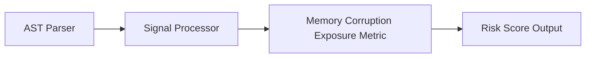

# Memory Corruption Exposure

> **File Reference:** [`gitgalaxy/metrics/signal_processor.py`](https://github.com/squid-protocol/gitgalaxy/blob/main/gitgalaxy/metrics/signal_processor.py)

## Engineering Summary
Measures exposure to low-level memory corruption vulnerabilities (e.g., Use-After-Free, buffer overflows, unmitigated pointer arithmetic, unsafe casting, inline assembly). This metric operates on an **Opt-In Whitelist** basis, evaluating only native unmanaged programming languages. Managed runtime languages bypass memory corruption calculations entirely. This subsystem evaluates the input signals to calculate a formalized risk score. In GitGalaxy, this subsystem is known as the Memory Corruption Exposure metric.

## Purpose
The metric calculates a density-based risk score (0-100) to flag files containing high-risk logic patterns and architectural deviations.

## Problem Being Solved
Unmitigated anti-patterns and vulnerabilities often lead to hard-to-debug bugs and security flaws. By statically analyzing the codebase, this subsystem proactively identifies hazardous logic.

## Design
For whitelisted languages, the analysis engine tallies raw memory heuristics against mitigation routines:

| Variable | Heuristic Signal | Weight | Description |
| :--- | :--- | :--- | :--- |
| `pointers` | `pointers` | **2.5x** | Raw pointer declarations and dereferencing operations (`*`, `->`, `&`). |
| `memory_alloc` | `memory_alloc` | **3.0x** | Dynamic memory allocation calls (`malloc`, `calloc`, `realloc`, `new`). |
| `inline_asm` | `inline_asm` | **5.0x** | Inline assembly blocks (`__asm__`, `asm`). |
| `explicit_casts` | `explicit_casts` | **1.5x** | Unsafe pointer conversions or explicit casting (`reinterpret_cast`). |
| `cleanup` | `cleanup` | **-1.0x** | Explicit memory deallocation calls (`free`, `delete`, destructor calls). |
| `safety` | `safety` | **-1.5x** | Bounds checking assertions, smart pointers, or safe wrappers. |

### 1. Raw & Mitigation Mass
$$\text{RawMemoryMass} = (\text{pointers} \times 2.5) + (\text{allocations} \times 3.0) + (\text{inline\_asm} \times 5.0) + (\text{casts} \times 1.5)$$
$$\text{MitigationMass} = \text{cleanup} + (\text{safety} \times 1.5)$$

### 2. Net Risk Synthesis
$$\text{NetRisk} = \max(\text{RawMemoryMass} - \text{MitigationMass}, 0.0) \times \text{ArchetypeMultiplier}$$

If explicit threat signals (`sec_high_risk_execution`, `sec_safety_bypasses`, `sec_reflection_metaprogramming`) are zero and non-paranoid mode is active, net risk is scaled down to $5\%$ ($\times 0.05$).

### 3. Sigmoid Normalization
$$\text{Density} = \left( \frac{\text{NetRisk}}{\max(\text{LOC} + 150, 1)} \right) \times 100.0$$

Standard mode uses a threshold of $25.0$ and slope of $0.4$; paranoid mode uses a threshold of $4.0$ and slope of $0.8$.

```python
native_memory_langs = {
    "c",
    "cpp",
    "objective-c",
    "rust",
    "zig",
    "assembly",
    "agc_assembly",
    "nim",
}
```

**Risk Classification:**
* 🟦 **LOW (Score 0–19):** Safe memory management wrappers or managed runtimes (Python, JS, Java, Go, C#).
* 🟨 **MODERATE (Score 40–59):** Bounded pointer operations with explicit allocation and cleanup safety guards.
* 🟥 **VERY HIGH (Score 80–100):** High-density raw pointer arithmetic, inline assembly, or unmitigated memory allocations lacking bounds checking and free/cleanup routines.

## Pipeline Integration
Inputs received include raw static analysis signals from the AST parser and contextual multipliers. Outputs produced are a normalized risk score (0-100). The subsystem depends on upstream token parsers that feed AST information into the signal processor.


## Tradeoffs
* Chose static keyword counting and heuristic multipliers over dynamic symbolic execution to prioritize speed across large codebases.
* Specific weights are fixed heuristics that balance safety against over-penalization, sacrificing precise dynamic validation for constant-time calculation.

## Limitations
* Detection is strictly reliant on recognized keywords and standard patterns.
* Cannot dynamically confirm actual vulnerabilities or trace deep runtime dataflows.
* May produce false positives in non-standard or heavily abstracted codebases.

## Performance Notes
The calculation operates in $O(1)$ time leveraging pre-computed token counts, making it suitable for real-time risk profiling on massive codebases.

## Future Work
* Planned improvements include integrating static dataflow tracing to verify execution paths and reduce false positives.
* Expand language support and framework-specific annotations.

## Related Components
* **[Signal Processor Module](https://github.com/squid-protocol/gitgalaxy/blob/main/gitgalaxy/metrics/signal_processor.py)**
* **[GitGalaxy Platform](https://gitgalaxy.io/)**
* **[⬅️ Back to Master Index](index.md)**
