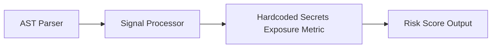

# Hardcoded Secrets Exposure

> **File Reference:** [`gitgalaxy/metrics/signal_processor.py`](https://github.com/squid-protocol/gitgalaxy/blob/main/gitgalaxy/metrics/signal_processor.py)

## Engineering Summary
Evaluates the presence of exposed sensitive credentials (API keys, private tokens, passwords, database connections) and analyzes careless code handling (e.g., debug log statements, dead code, global variable assignments) that increases the likelihood of accidental credential leakage. This subsystem evaluates the input signals to calculate a formalized risk score. In GitGalaxy, this subsystem is known as the Hardcoded Secrets Exposure metric.

## Purpose
The metric calculates a density-based risk score (0-100) to flag files containing high-risk logic patterns and architectural deviations.

## Problem Being Solved
Unmitigated anti-patterns and vulnerabilities often lead to hard-to-debug bugs and security flaws. By statically analyzing the codebase, this subsystem proactively identifies hazardous logic.

## Design
The analysis engine evaluates credential presence and careless code practice multipliers:

| Variable | Signal Key | Weight | Description |
| :--- | :--- | :--- | :--- |
| `sec_hardcoded_secrets` | Static Pattern | **10.0x Base** | Regex matches for private API keys, tokens, or passwords. |
| `debug_prints` | `debug_prints` | **+1.0 Amplification** | Print/log statements (`console.log`, `print`, `logger.info`) near secrets. |
| `dead_code` | `dead_code` | **+1.0 Amplification** | Commented-out or unreachable code blocks containing hardcoded keys. |
| `globals` | `globals` | **+1.0 Amplification** | Secrets assigned to global scope variables. |
| `llm_api` | `llm_api` | **3.0x Multiplier** | Calling external APIs (`llm_api > 0`) without global config management (`globals == 0`). |

### 1. Base Leak & Amplification Mass
$$\text{BaseLeak} = \text{sec\_hardcoded\_secrets} \times 10.0$$
$$\text{Amplifiers} = 1.0 + \text{debug\_prints} + \text{dead\_code} + \text{globals}$$

If external API calls are detected without global configuration structures, amplifiers spike by $3.0\times$:

$$\text{Amplifiers} = \text{Amplifiers} \times 3.0$$

In standard non-paranoid mode without reflection/metaprogramming signals, amplifiers are capped at $2.0$.

### 2. Leak Mass Formulation
$$\text{LeakMass} = \text{BaseLeak} \times \text{Amplifiers}$$

### 3. Sigmoid Normalization with Reduced Padding
Because leaked credentials represent high severity regardless of file size, density uses a reduced Laplace padding ($\text{LOC} + 50$):

$$\text{Density} = \left( \frac{\text{LeakMass}}{\max(\text{LOC} + 50, 1)} \right) \times 100.0$$

Mapped via Sigmoid (Standard threshold = 3.0, slope = 1.0; Paranoid threshold = 0.5, slope = 2.0). Scores below $5.0$ are truncated to $0.0$.

```python
def _calc_secrets_risk(self, loc: int, raw_signals: dict[str, int], mp: float) -> float:
    """
    Calculates Secrets Risk Exposure (Credential Exposure).
    """
    base_leak = raw_signals.get("sec_hardcoded_secrets", 0) * 10.0

    if base_leak == 0:
        return 0.0

    careless_amplifiers = (
        1.0 + raw_signals.get("debug_prints", 0) + raw_signals.get("dead_code", 0) + raw_signals.get("globals", 0)
    )

    if raw_signals.get("llm_api", 0) > 0 and raw_signals.get("globals", 0) == 0:
        careless_amplifiers *= 3.0

    if not getattr(self, "is_paranoid", False) and raw_signals.get("sec_reflection_metaprogramming", 0) == 0:
        careless_amplifiers = min(careless_amplifiers, 2.0)

    leak_mass = base_leak * careless_amplifiers

    t = self.risk_tuning.get("secrets_risk", {})
    density = (leak_mass / max(loc + t.get("loc_padding", 50), 1)) * 100.0

    if getattr(self, "is_paranoid", False):
        threshold = t.get("paranoid_threshold", 0.5)
        slope = t.get("paranoid_slope", 2.0)
    else:
        threshold = t.get("std_threshold", 3.0)
        slope = t.get("std_slope", 1.0)

    try:
        score = 100.0 / (1.0 + math.exp(-slope * (density - threshold)))
    except OverflowError:
        score = 100.0 if density > threshold else 0.0

    if score < 5.0:
        score = 0.0

    return min(score * mp, 100.0)
```

**Risk Classification:**
* 🟦 **LOW (Score 0–19):** Secrets safely retrieved via environment variables or secret management vaults.
* 🟨 **MODERATE (Score 40–59):** Low-entropy credentials or test environment secrets.
* 🟥 **VERY HIGH (Score 80–100):** High-entropy secrets paired with debug logging, or inline API keys in modules lacking global configuration parameters.

## Pipeline Integration
Inputs received include raw static analysis signals from the AST parser and contextual multipliers. Outputs produced are a normalized risk score (0-100). The subsystem depends on upstream token parsers that feed AST information into the signal processor.


## Tradeoffs
* Chose static keyword counting and heuristic multipliers over dynamic symbolic execution to prioritize speed across large codebases.
* Specific weights are fixed heuristics that balance safety against over-penalization, sacrificing precise dynamic validation for constant-time calculation.

## Limitations
* Detection is strictly reliant on recognized keywords and standard patterns.
* Cannot dynamically confirm actual vulnerabilities or trace deep runtime dataflows.
* May produce false positives in non-standard or heavily abstracted codebases.

## Performance Notes
The calculation operates in $O(1)$ time leveraging pre-computed token counts, making it suitable for real-time risk profiling on massive codebases.

## Future Work
* Planned improvements include integrating static dataflow tracing to verify execution paths and reduce false positives.
* Expand language support and framework-specific annotations.

## Related Components
* **[Signal Processor Module](https://github.com/squid-protocol/gitgalaxy/blob/main/gitgalaxy/metrics/signal_processor.py)**
* **[GitGalaxy Platform](https://gitgalaxy.io/)**
* **[⬅️ Back to Master Index](index.md)**
