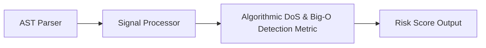

# Algorithmic DoS & Big-O Detection

> **File Reference:** [`gitgalaxy/metrics/signal_processor.py`](file:///home/joe/nyx_projects/gitgalaxy/gitgalaxy/metrics/signal_processor.py)

## Engineering Summary
Performance and algorithmic complexity directly impact application security. Deeply nested loops ($O(N^2)$, $O(N^3)$) or exponential recursion ($O(2^N)$) connected to public API endpoints or network I/O present severe Algorithmic Denial of Service (DoS) vulnerabilities. GitGalaxy evaluates function nesting depth and correlates it with public exposure and data operations. This subsystem evaluates the input signals to calculate a formalized risk score. In GitGalaxy, this subsystem is known as the Algorithmic DoS & Big-O Detection metric.

## Purpose
The metric calculates a density-based risk score (0-100) to flag files containing high-risk logic patterns and architectural deviations.

## Problem Being Solved
Unmitigated anti-patterns and vulnerabilities often lead to hard-to-debug bugs and security flaws. By statically analyzing the codebase, this subsystem proactively identifies hazardous logic.

## Design
The engine analyzes function complexity depth, choke point multipliers, and guardrail mitigations:

| Variable | Signal Focus | Role / Multiplier | Description |
| :--- | :--- | :--- | :--- |
| `big_o_depth` | Algorithmic Depth | **Exponential Base** | Evaluates nesting depth. $O(N)$ ($\text{depth} < 2$) is ignored. $O(N^2)$ yields base threat of $4$; $O(N^3)$ yields base threat of $9$. |
| `api` / `io` | Choke Points | **Additive Multiplier** | Functions exposed to public APIs or network I/O act as weaponizable triggers. |
| `state_mutation` / `globals` | State Mutation | **Additive Multiplier** | Mutating state inside high-depth loops increases risk. |
| `safety` / `panics_and_aborts` | Guardrails | **0.5x Dampener** | Break statements, return limits, and try/catch blocks reduce function threat mass by $50\%$. |
| `popularity` | Network Posture | **0.1x – 3.0x** | Repository-wide import popularity scales the final threat mass. Safely isolated orphans are scaled to $0.10$. |

> **#1013:** this metric used to also fold in a per-function `db_complexity` score
> as a "Database Gravity" multiplier. It was removed engine-wide: despite the name,
> it never looked for databases at all, it just summed unrelated `io` (x3),
> `serialization_parsing` (x2), and `state_mutation` (x1) signature hits -- so any
> IO-heavy or mutation-heavy function scored as "database complex" even with zero
> database or ORM involvement. `api`/`io` choke points below already cover the real
> IO signal this used to (partially, and inaccurately) proxy for.

### 1. Function Base Threat & Amplifiers
For each function with nesting depth $\ge 2$:

$$\text{BaseThreat} = \text{big\_o\_depth}^2$$
$$\text{ChokeMultiplier} = 1.0 + \text{api\_hits} + \text{io\_hits} + \text{flux\_hits}$$
$$\text{FuncThreat} = \text{BaseThreat} \times \text{ChokeMultiplier}$$

### 2. Guardrail Mitigation
If safety guardrails (`safety`, `panics_and_aborts`, `cleanup`) exist within the function, threat mass is halved:

$$\text{FuncThreat} = \text{FuncThreat} \times 0.5$$

### 3. Total Threat Mass & Network Posture
Sum all function threat scores to yield `dos_mass`. Then apply the network posture (popularity) multiplier:

$$\text{network\_multiplier} = \begin{cases} 0.10 & \text{if } \text{popularity} = 0 \text{ and } \text{api} = 0 \\ \min(1.0 + \frac{\ln(1 + \text{popularity})}{5.0}, 3.0) & \text{if } \text{popularity} > 0 \\ 1.0 & \text{otherwise} \end{cases}$$

$$\text{TotalThreatMass} = \text{dos\_mass} \times \text{network\_multiplier}$$

### 4. Sigmoid Mapping
Compute density per padded line of code ($\text{LOC} + 150$) and map via Sigmoid (Base threshold = 15.0, slope = 0.3):

$$\text{Density} = \left( \frac{\text{TotalThreatMass}}{\max(\text{LOC} + 150, 1)} \right) \times 100.0$$
$$\text{FinalScore} = \min(\text{Sigmoid}(\text{Density}, \text{Threshold}=15.0, \text{Slope}=0.3) \times 100.0 \times Mp, 100.0)$$

```python
def _calc_algorithmic_dos(
    self,
    loc: int,
    raw_signals: dict[str, int],
    mp: float,
    functions: list[dict[str, Any]],
    popularity: int,
) -> float:
    """
    Calculates Algorithmic DoS Exposure based on Big-O depth and network choke points.
    """
    if not functions:
        return 0.0

    dos_mass = 0.0

    for func in functions:
        depth = func.get("big_o_depth", 1)
        # 1. Ignore O(N) linear loops
        if depth < 2:
            continue

        # 2. Base Threat (Exponential decay of performance)
        func_threat = float(depth**2)

        # 3. Network Choke Points
        hv = func.get("hit_vector", {})
        api_hits = hv.get("api", 0)
        io_hits = hv.get("io", 0) + hv.get("sec_io", 0)
        flux_hits = hv.get("state_mutation", 0) + hv.get("globals", 0)

        choke_multiplier = 1.0 + api_hits + io_hits + flux_hits
        func_threat *= choke_multiplier

        # 4. Structural Dampeners (Guardrails)
        safety_hits = hv.get("safety", 0) + hv.get("panics_and_aborts", 0) + hv.get("cleanup", 0)
        if safety_hits > 0:
            func_threat *= 0.5  # 50% reduction for bounded iteration

        dos_mass += func_threat

    if dos_mass == 0.0:
        return 0.0

    # 5. Network Posture (Blast Radius)
    network_multiplier = 1.0
    if popularity == 0 and raw_signals.get("api", 0) == 0:
        network_multiplier = 0.10  # Safely isolated orphan
    elif popularity > 0:
        network_multiplier = min(1.0 + (math.log1p(popularity) / 5.0), 3.0)

    total_threat_mass = dos_mass * network_multiplier

    # 6. The Sigmoid Curve
    t = self.risk_tuning.get("algorithmic_dos", {})
    density = (total_threat_mass / max(loc + t.get("loc_padding", 150), 1)) * 100.0

    threshold = t.get("threshold_base", 15.0)
    slope = t.get("sigmoid_slope", 0.3)

    try:
        score = 100.0 / (1.0 + math.exp(-slope * (density - threshold)))
    except OverflowError:
        score = 100.0 if density > threshold else 0.0

    return min(score * mp, 100.0)
```

**Risk Classification:**
* 🟦 **VERY LOW (Score 0–19):** Linear $O(N)$ execution or safely bounded stream iterations.
* 🟨 **INTERMEDIATE (Score 40–59):** Isolated $O(N^2)$ logic guarded by safety bailouts or low exposure.
* 🟥 **VERY HIGH (Score 80–100):** Recursive $O(2^N)$ or $O(N^3)$ loops directly wired into unauthenticated public API routes or state-mutating I/O operations.

## Pipeline Integration
Inputs received include raw static analysis signals from the AST parser and contextual multipliers. Outputs produced are a normalized risk score (0-100). The subsystem depends on upstream token parsers that feed AST information into the signal processor.


## Tradeoffs
* Chose static keyword counting and heuristic multipliers over dynamic symbolic execution to prioritize speed across large codebases.
* Specific weights are fixed heuristics that balance safety against over-penalization, sacrificing precise dynamic validation for constant-time calculation.

## Limitations
* Detection is strictly reliant on recognized keywords and standard patterns.
* Cannot dynamically confirm actual vulnerabilities or trace deep runtime dataflows.
* May produce false positives in non-standard or heavily abstracted codebases.

## Performance Notes
The calculation operates in $O(1)$ time leveraging pre-computed token counts, making it suitable for real-time risk profiling on massive codebases.

## Future Work
* Planned improvements include integrating static dataflow tracing to verify execution paths and reduce false positives.
* Expand language support and framework-specific annotations.

## Related Components
* **[Signal Processor Module](file:///home/joe/nyx_projects/gitgalaxy/gitgalaxy/metrics/signal_processor.py)**
* **[GitGalaxy Platform](https://gitgalaxy.io/)**
* **[⬅️ Back to Master Index](index.md)**
